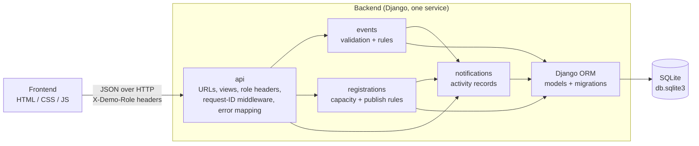

# Venn – Community Events Platform

A small Community Events Platform. **Visitors** browse published events and register anonymous interest, **Organisers** create and manage their events, and **Administrators** review and publish and delete events before they go live.

- One backend service (Python / Django) with a modular layout
- SQLite for persistence (a single file, no database server to install)
- A plain HTML/CSS/JavaScript frontend served by the backend (no build step)
- All data is fictional; registrations store no personal information

## 1. Setup and run

**Prerequisites:** Python 3.12 or newer (tested on 3.12, 3.13 and 3.14, with Django 6.0 and 6.1). If `pip install` says it "could not find a version that satisfies Django>=6.0", your Python is older than 3.12. Nothing else: SQLite ships with Python, and the frontend needs no Node.js or build.

```bash
python3 -m venv .venv
source .venv/bin/activate          # Windows: .venv\Scripts\activate
pip install -r requirements.txt
python manage.py migrate           # creates db.sqlite3 and the tables
python manage.py seed_demo_data    # loads fictional demo events
python manage.py runserver 8123
```

Then open **http://127.0.0.1:8123**. Logs are printed to the same terminal.

| What | Where |
| --- | --- |
| Frontend | http://127.0.0.1:8123/ |
| API base | http://127.0.0.1:8123/api |
| Health check | http://127.0.0.1:8123/api/health |

**Database setup.** `migrate` creates `db.sqlite3` from the migrations in each app. `seed_demo_data` loads 10 fictional events (some already near capacity) and does nothing if events already exist, so running it twice never duplicates data. To go back to the original demo data at any time: `python manage.py seed_demo_data --reset`.

**Configuration.** Everything is optional and has a working default; see [.env.example](.env.example). The app reads real environment variables (it does not parse the file), e.g. `LOG_LEVEL=DEBUG python manage.py runserver 8123`.

| Variable | Default | Purpose |
| --- | --- | --- |
| `EVENTS_DB_PATH` | `db.sqlite3` | SQLite file location |
| `LOG_LEVEL` | `INFO` | `DEBUG`, `INFO`, `WARNING`, `ERROR` |
| `DJANGO_DEBUG` | `false` | Keep off so errors never show debug pages or stack traces |
| `DJANGO_SECRET_KEY` | random per start | Nothing is signed or stored in sessions, so no secret needs committing |
| `DJANGO_ALLOWED_HOSTS` | `localhost`, `127.0.0.1` | Extra allowed Host headers, comma-separated |

No secrets or API keys are needed.

**Port already in use?** Pick another: `python manage.py runserver 9000` (and use that port in the URLs below).

**`ModuleNotFoundError: No module named 'django.utils.csp'`, or "This project needs Django 6.0 or newer"?** You are running a different Python from the project's virtual environment, for example a global one with an older Django. Run the commands from the folder that contains `manage.py`, and activate the environment in every new terminal with `source .venv/bin/activate`. Check with `python -c "import django; print(django.get_version())"`, which should print 6.x. In VS Code, pick the `.venv` interpreter (*Python: Select Interpreter*).

## 2. Technology choices

| Area | Choice | Why |
| --- | --- | --- |
| Backend | Python 3.12+, Django 6 | Batteries included: routing, ORM, migrations, a test client and sensible security defaults. The only runtime dependency |
| Persistence | SQLite via the Django ORM, with migrations | Zero setup for reviewers; real constraints and transactions; data survives restarts |
| Frontend | Vanilla HTML/CSS/JS, served by Django | No toolchain to install; the UI is small enough that a framework adds more than it saves |
| Tests | Django's built-in test runner and test client | No extra dependency; each test runs in a rolled-back transaction on a throwaway database |
| Logging | Standard `logging`, configured in settings, with a request-ID context variable | Every log line carries the request ID |

The only third-party library is **Django** itself.

## 3. Architecture



```
manage.py                   Django's command-line entry point
backend/
  settings.py, urls.py      project configuration and top-level routes
  api/                      HTTP layer: views, URLs, demo-role parsing, request-ID middleware, JSON error handlers
  events/                   Event model + migrations, validation, services (business rules), serializer, seed command
  registrations/            Registration model + migrations, services (published? room left?)
  notifications/            Activity model + migrations, services
  tests/                    Django test suite
frontend/                   index.html, styles.css, app.js, images/ (stock photos, see credits)
```

Layering: `api` handles HTTP only; the `services` modules hold the business rules and know nothing about HTTP (they raise typed errors that the API layer maps to status codes); the models and migrations are the persistence layer.

### Roles (demo only)

There is no authentication, as permitted by the brief. The **“Continue as”** menu in the header picks the demo role, and the frontend sends it on every request as `X-Demo-Role` (`visitor`, `organiser`, `admin`) plus `X-Demo-Organiser-Id` (e.g. `organiser-1`) for organisers. The backend trusts these headers, **which is not real security**, but it does enforce the rules server-side: only Administrators can publish, only an event's own organiser can edit it, and Visitors cannot see unpublished events.

## 4. Data model

Django models (see `backend/*/models.py`; migrations are in each app's `migrations/` folder). Timestamps are stored in UTC.

**`Event`** (table `events_event`): `id` (e.g. `EVT-1001`), `title`, `description`, `category`, `starts_at`, `capacity`, `status` (`PENDING_REVIEW` or `PUBLISHED`), `organiser_id`, `created_at`, `updated_at`. Database constraints enforce `capacity > 0` and a valid `status`.

**`Registration`** (table `registrations_registration`): `id` (e.g. `REG-1A2B3C4D`), `event` (foreign key), `registered_at`. These three columns are *all* that is stored: no names, emails, IP addresses, user agents or free text.

**`Activity`** (table `notifications_activity`, the notification/activity record): `type` (`EVENT_PUBLISHED` or `REGISTRATION_CREATED`), `event_id`, `message` (e.g. “Event EVT-1008 was published.”), `request_id`, `created_at`. Shown to Administrators in the Review screen.

The number of registrations for an event is *counted* from the registrations table (an annotated query), never stored separately, so it cannot drift out of sync.

**Persistence:** everything lives in the SQLite file `db.sqlite3`, which **survives application restarts**. Delete it (then run `migrate` and `seed_demo_data` again) to start from scratch.

### API

| Method & path | Role | Success | Notes |
| --- | --- | --- | --- |
| `GET /api/events?category=&upcoming=` | anyone | 200 | Published events only |
| `GET /api/events/{id}` | anyone | 200 | Unpublished events are 404 unless you are an Administrator or the owning Organiser |
| `POST /api/events/{id}/registrations` | anyone | 201 | 409 `EVENT_NOT_PUBLISHED` / `REGISTRATION_CLOSED` (already started) / `EVENT_FULL`, 404 if unknown |
| `GET /api/organiser/events` | organiser | 200 | Only that organiser's events |
| `POST /api/events` | organiser | 201 | Always created as `PENDING_REVIEW` |
| `DELETE /api/events/{id}` | admin | 200 | Deletes the event and its registrations |
| `PUT /api/events/{id}` | organiser (owner) | 200 | 403 for another organiser's event |
| `GET /api/admin/events?status=` | admin | 200 | All events |
| `POST /api/events/{id}/publish` | admin | 200 | 409 `EVENT_NOT_PENDING_REVIEW` if already published |
| `GET /api/admin/activity` | admin | 200 | Most recent first |
| `GET /api/health` | anyone | 200 | |


Errors always use the same shape and never include stack traces, SQL, paths or configuration:

```json
{ "code": "EVENT_FULL", "message": "Registration is no longer available because this event is full." }
```

Validation errors (400) also include a `fields` object, e.g. `{"capacity": "Capacity must be a whole number greater than zero."}`. Unexpected errors return a generic 500 (`INTERNAL_ERROR`), and a database that is not ready or stays locked returns a generic 503 (`SERVICE_UNAVAILABLE`); the details, with traceback, go only to the server log (which also reminds you to run `migrate` if tables are missing). Errors Django raises itself (unknown URL, wrong method, bad Host header, oversized body) are also returned as JSON in the same shape.

### Validation rules

Title required (max 120 chars, no control characters) · date/time required, valid ISO-8601 and not in the past (an unchanged date is not re-checked when editing other fields) · capacity a whole number greater than zero (not a string, float or boolean) · category one of the fixed list · request body at most 64 KB · registration only for published events that have not started yet · registration refused once capacity is reached.

**Capacity race:** the capacity check and the insert run in one transaction that takes the write lock (`select_for_update` on the event row, plus SQLite's `IMMEDIATE` transaction mode configured in `settings.py`), so two people cannot both take the last place.

## 5. Testing

```bash
python manage.py test
```

47 tests, no running server needed (Django creates a throwaway test database). They cover the business rules, not framework boilerplate:

- validation: empty/overlong title, zero/negative/non-integer capacity, invalid or past date, bad category, malformed, absurdly nested or oversized JSON, control characters, out-of-range dates; the database itself also rejects capacity 0
- a new event is `PENDING_REVIEW` and invisible to Visitors (list *and* detail)
- publishing makes the event visible, records an activity entry, and is admin-only; publishing twice is a 409
- deleting an event is administrator-only and removes the event from persistence
- registration succeeds with room, is rejected for an unpublished event, once the event has started (checked at the exact start time) and once the event is full
- registrations store no personal data (checked against the actual table columns)
- organisers cannot edit each other's events or self-publish via the request body; capacity cannot drop below existing registrations
- the request ID is echoed, logged in order across the registration workflow, and stored on the activity entry
- every rejected request is logged with its error code (and field names, never the submitted values); successes log `outcome=success`
- unexpected errors return a generic 500 and database failures a generic 503, with no internal details; unknown routes and wrong methods return JSON errors
- security headers (CSP, `nosniff`, `no-store` on the API); the frontend and its photos are served; demo data seeds once and `--reset` restores it

**Known limitations:** there are no frontend tests (out of scope per the brief); the browser UI was checked by hand and with a scripted run-through but is not covered by the suite; the capacity race is handled by design (locking) rather than by a multi-threaded test.

## 6. Demonstration guide

Start the app (section 1) and keep the terminal visible for the logs. Seeded data includes **EVT-1007 “Poetry Open Mic” (2 of 3 places taken)** and three events awaiting review (**EVT-1008, EVT-1009, EVT-1010**).

### Role workflows (7.1–7.3)

**Visitor:** *Continue as → Visitor* → browse the cards (use the category chips to filter) → **View Event** → **Register interest**. A confirmation shows the registration reference, and the spots count updates.

**Organiser:** *Continue as → Organiser · organiser-1* → **My events** → **New event** → fill in the form → **Submit for review**. (The green **New event** button in the header and **Create an Event** on the home page do the same from any page. They are shown to Organisers only: Visitors and Administrators don't see any create action.) The event appears with status *Pending review*. Switch to *Visitor* and open **Discover**: it is not listed. Switch back to the organiser and click **Edit** to update it. (To see backend validation, submit the form empty or with capacity `0`: the messages shown come from the server, because the form deliberately has no client-side checks.)

**Administrator:** *Continue as → Administrator* → **Review** → see all events including *Pending review* ones → **Publish** an event → the *Recent activity* list shows “Event … was published.” → switch to *Visitor* and confirm it now appears in **Discover**. Administrators can also **Delete** events; the UI asks for confirmation before the event is removed.

### Registration rules (7.4)

Unpublished events don't appear to Visitors in the UI, so the rejected cases are easiest to show with `curl`:

```bash
# Succeeds: published event with room
curl -i -X POST localhost:8123/api/events/EVT-1001/registrations

# Rejected (409 EVENT_NOT_PUBLISHED): event EVT-1009 is still pending review
curl -i -X POST localhost:8123/api/events/EVT-1009/registrations

# Rejected (409 EVENT_FULL): EVT-1007 has one place left; the second call is refused
curl -i -X POST localhost:8123/api/events/EVT-1007/registrations
curl -i -X POST localhost:8123/api/events/EVT-1007/registrations
```

(In the UI, the full event shows a **Full** badge and a disabled **Event full** button.)

### Logging (7.5)

Every request gets a request ID: it is accepted from an `X-Request-ID` header (or generated), echoed back in the response, included in every log line, and stored on the resulting activity record.

```bash
curl -s -X POST localhost:8123/api/events/EVT-1002/registrations -H 'X-Request-ID: demo-123'
```

Server output for that one request:

```
INFO  [demo-123] backend.api.middleware: request received method=POST path=/api/events/EVT-1002/registrations
INFO  [demo-123] backend.registrations.services: registration requested event_id=EVT-1002
INFO  [demo-123] backend.registrations.services: event validated event_id=EVT-1002 spots_remaining=24
INFO  [demo-123] backend.registrations.services: registration stored registration_id=REG-… event_id=EVT-1002
INFO  [demo-123] backend.notifications.services: activity recorded type=REGISTRATION_CREATED event_id=EVT-1002
INFO  [demo-123] backend.registrations.services: registration completed registration_id=REG-… event_id=EVT-1002 outcome=success
INFO  [demo-123] backend.api.middleware: request completed method=POST path=/api/events/EVT-1002/registrations status=201 duration_ms=1.3
```

Every rejected request is also logged at `WARNING` with its outcome, whatever the reason: registration rules (`outcome=EVENT_FULL`), validation, permissions or unknown events. Only the error code and the *names* of invalid fields are logged, never what was submitted:

```
WARNING [chk-1] backend.api.views: request rejected method=POST path=/api/events status=400 code=VALIDATION_ERROR fields=title,capacity
WARNING [chk-2] backend.api.views: request rejected method=POST path=/api/events/EVT-1008/publish status=403 code=FORBIDDEN
```

Unexpected server errors are logged at `ERROR` with the full traceback (and returned to the client only as a generic message).

**How this maps to the brief (6.3):** the operation name, event ID and registration ID are in each line; `outcome=` / `code=` records the result; the request ID is on every line and echoed in the `X-Request-ID` response header; server-side error details go to the log only. No personal data is logged, and line breaks in logged values are escaped so user input cannot forge log lines.

### Two-service workflow (7.6)

Not implemented; see below.

## 7. Assumptions, trade-offs and future improvements

**Deliberate decisions**

- **One service, no second backend.** The brief ranks a complete one-service solution above an incomplete two-service one. The apps (`events`, `registrations`, `notifications`) are separated by clear boundaries, so a split would be possible later.
- **A deliberately minimal Django.** No admin site, user model, sessions or CSRF middleware: the brief only needs demo roles, and there are no cookies or logins for CSRF to protect. If real authentication were added, CSRF protection should be switched on.
- **No Django REST Framework.** The API is a handful of JSON endpoints, so plain class-based views, a small validation module and `JsonResponse` keep it easy to follow. DRF serializers would be the natural next step if the API grew.
- **Demo roles via headers, trusted by the server.** Acceptable per the brief, and enforced server-side, but not secure. A real system would use proper authentication.
- **Event text is plain text.** The backend returns JSON only; the frontend inserts text with `textContent` (never as HTML), and Django's CSP middleware sends a restrictive `Content-Security-Policy` alongside `X-Content-Type-Options: nosniff`.
- **Photos are decorative stock images**, one per category plus the hero, committed in `frontend/images/` (no hotlinking, nothing uploaded by users: file uploads are out of scope). The category gradient shows underneath if an image ever fails to load.
- **Category and filter chips** are a small extension beyond the required event fields, to follow the UI design (Technology, Sports, etc.). “Upcoming” hides events whose start time has passed.
- **Dates** are stored in UTC and shown in the viewer's local time. A date-time sent without an offset is treated as UTC (the frontend always sends UTC).
- **Statuses** are just `PENDING_REVIEW` and `PUBLISHED`; `REJECTED`/`CANCELLED` were optional and left out.
- **Registration closes when an event starts.** This goes one step beyond the brief's three registration rules, because registering interest in something that has already begun makes no sense. The data model has no end time, so the start time is the cut-off. It is enforced on the server (`REGISTRATION_CLOSED`) and the UI shows a "Started" flag and a disabled button. The seed data is all in the future, so this is shown by the tests rather than the demo.
- **Anonymous registrations are not de-duplicated**, as the brief states.
- **Development server and static files.** `runserver` and Django's static-file view are fine for a local demo; a production deployment would use a real WSGI server (e.g. gunicorn) and serve the frontend from a web server or WhiteNoise.

**Known limitations**

- The role headers can be set by anyone; there is no authentication.
- Editing a published event takes effect immediately without a new review; there is no way to unpublish.
- Activity entries are visible to Administrators only, and there is no pagination (the activity list shows the latest 50).
- Locking is the in-process/SQLite kind: it protects this single-file database, not a multi-server deployment.

**With more time**

- Real authentication and per-organiser accounts
- `REJECTED` / `CANCELLED` statuses and an unpublish action
- Pagination and search for events
- A multi-threaded test for the last-place race; frontend tests
- OpenAPI documentation, a GitHub Actions workflow, and Docker Compose
- A second service (e.g. notifications) with request-ID propagation and graceful handling when it is unavailable

## 8. Photo credits

The photos in `frontend/images/` are free stock images from [Pexels](https://www.pexels.com), used under the [Pexels License](https://www.pexels.com/license/) and resized/compressed for the web. Thanks to the photographers:

| File | Photo | Photographer |
| --- | --- | --- |
| `hero.jpg` | [Group of Friends Watching the Sunset](https://www.pexels.com/photo/group-of-friends-watching-the-sunset-6125822/) | Rachel Claire |
| `technology.jpg` | [Crowd on Gathering in Hall](https://www.pexels.com/photo/crowd-on-gathering-in-hall-15448073/) | Luis Quintero |
| `sports.jpg` | [Silhouette of Jogger at Sunset in Park](https://www.pexels.com/photo/silhouette-of-jogger-at-sunset-in-park-34730429/) | Cara Denison |
| `arts.jpg` | [Painting Brush on Palette](https://www.pexels.com/photo/painting-brush-on-palette-1108532/) | Yigithan Bal |
| `community.jpg` | [Hands of a Woman Planting in a Garden](https://www.pexels.com/photo/hands-of-a-woman-planting-in-a-garden-27176769/) | Helena Lopes |
| `food.jpg` | [Vegetables Stall](https://www.pexels.com/photo/vegetables-stall-868110/) | AS Photography |
| `nature.jpg` | [Plain Field in Front of Mountain Peak](https://www.pexels.com/photo/plain-field-in-front-of-mountain-peak-459225/) | Pixabay |

## 9. AI-use declaration
**Tool used:** GitHub Copilot.
**How it was used:** GitHub Copilot was used as a coding assistant during development. I used it primarily to help build parts of the frontend, as implementing the UI and styling was time-consuming, and to assist with a portion of the Django backend. I used it to generate and suggest code, structure components and functions, and help troubleshoot implementation issues.
**What I personally reviewed, changed, tested or validated:** I reviewed the generated code and integrated it into the project, making changes where necessary to fit the application's requirements and architecture. I personally tested the application's core workflows, including the Visitor, Organiser and Administrator flows, event creation and publishing, registration rules, validation and error handling. I also reviewed the backend logic and API behaviour to ensure that the implementation matched the assessment requirements. I understand that I am responsible for the submitted code and can explain the main design decisions, business rules and implementation choices.